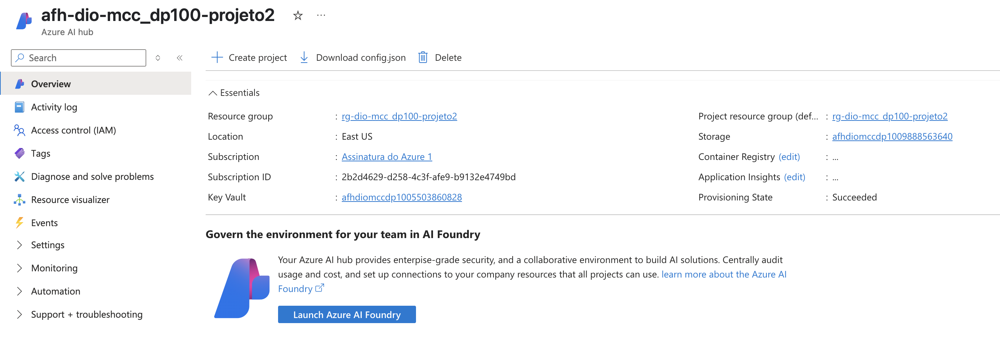
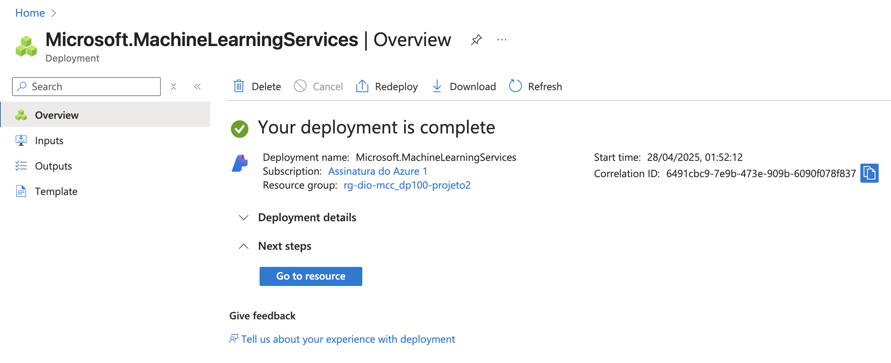
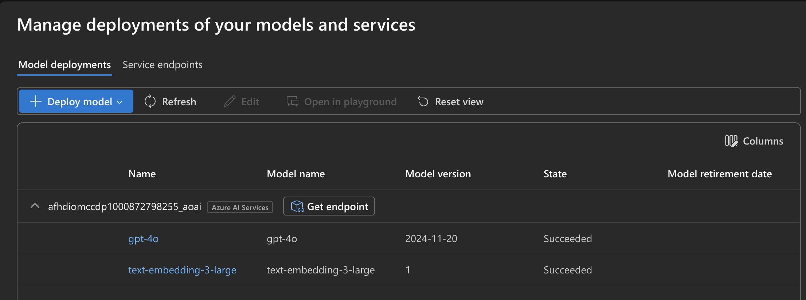
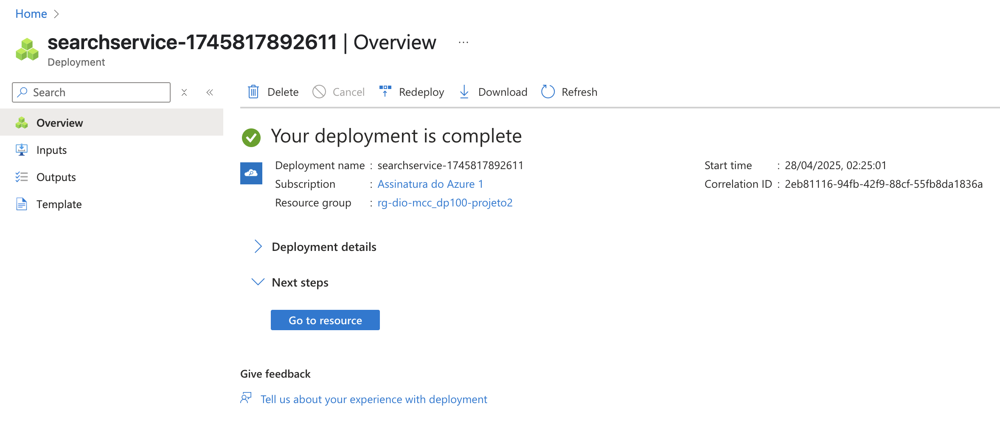
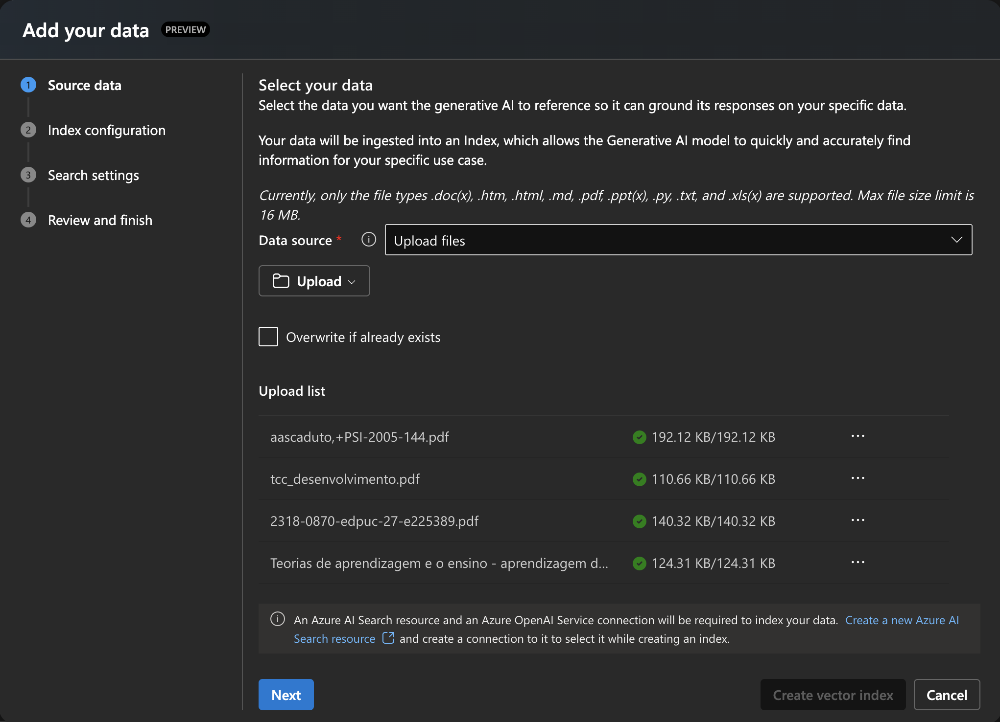
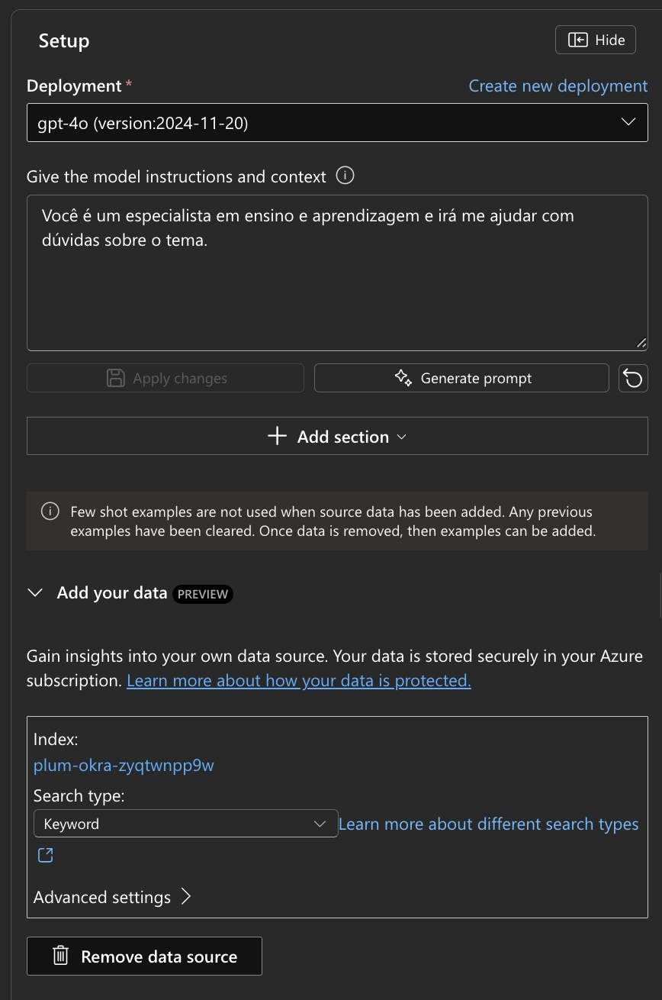
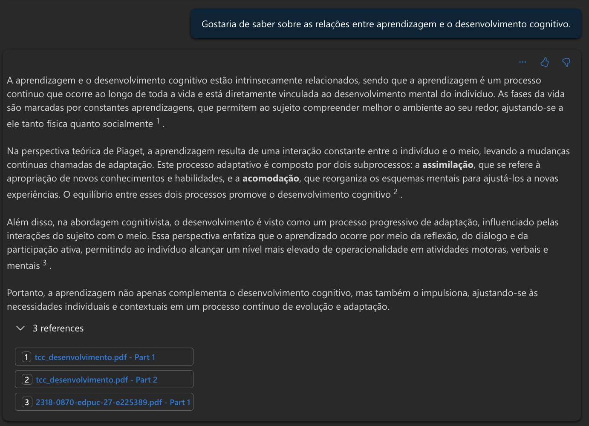
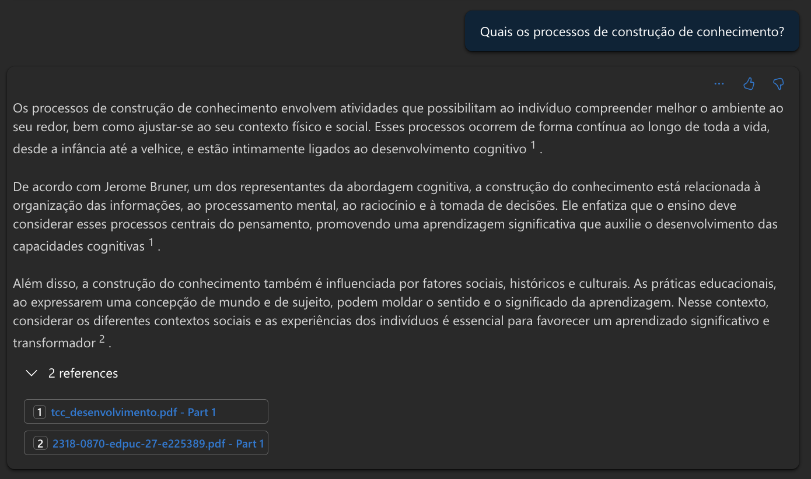
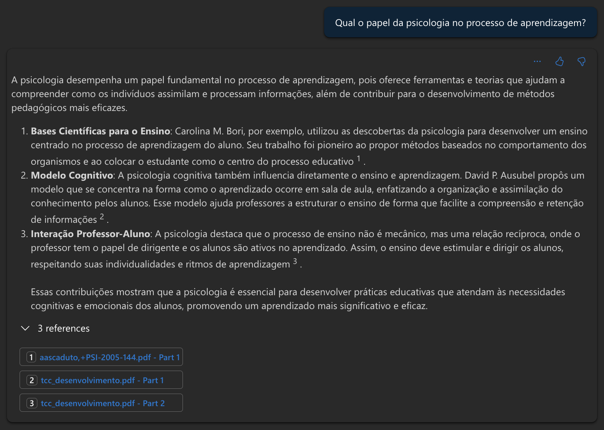

# Desafio de Projeto 2 - Criação de Chatbot Baseado em Conteúdo PDF

## Proposta

Desenvolver um chatbot para encontrar conexões relevantes entre temas presentes em diversos arquivos ".pdf", de modo a estruturar e otimizar a pesquisa para escrita de um TCC relacionado ao tema de "ensino e aprendizagem". Serão utilizados o Azure Foundry e inteligência artificial generativa como recursos para este projeto.

## Resumo do projeto

- Inicialmente foi criado um novo grupo de recursos para reunir todos os utilizados no desenvolvimento deste projeto específico;
- Foram criados um hub e um projeto do "Azure AI Foundry";

- Escolheu-se o modelo de LLM "gpt-4o" para processar e analisar as requisições e o conteúdo dos arquivos. Para a vetorização dos arquivos ".pdf", escolheu-se o modelo "text-embedding-3-large";

- Após a implantação dos modelos, foi criado o recurso "Azure AI Search", necesário para indexação dos dados;

- Os dados a serem utilizados como parâmetros para as consultas foram carregados e adicionada conexão com o recurso para indexação do conteúdo;

- Adicionou-se contexto e instruções para o modelo e, como forma de demonstrar e testar o seu funcionamento, foram criados prompts de perguntas simples através do chat. Como resultado foi possível observar o cruzamento de informações e referenciação entre os arquivos carregados;

- Tendo sido atingidos os objetivos esperados, o modelo encontra-se pronto para ser implantado em um aplicativo.
